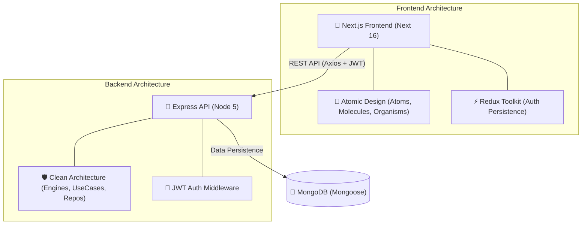

<div align="center">

# 🌍 JobPilot — Full-Stack Job Portal

**A production-grade, pixel-perfect employer ecosystem built with Next.js, Express, and Clean Architecture.**

[](./frontend)
[](./backend)
[](https://www.mongodb.com/)
[](https://www.typescriptlang.org/)

</div>

---

## 📋 Table of Contents

- [Overview](#-overview)
- [System Architecture](#-system-architecture)
- [Project Structure](#-project-structure)
- [Tech Stack](#-tech-stack)
- [Core Features](#-core-features)
- [Quick Start](#-quick-start)
- [Environment Configuration](#-environment-configuration)
- [Component & Data Flow](#-component--data-flow)

---

## 🌟 Overview

JobPilot is a comprehensive Job Portal application designed for **Employers**. It allows company owners to manage their entire hiring lifecycle through a high-performance, responsive dashboard. From multi-step secure registration and company profile setup to posting, editing, and managing job listings with real-time ownership validation, JobPilot provides a premium user experience baked into a robust, scalable backend.

This repository is organized as a monorepo, containing both the **JobPilot Frontend** (Next.js) and the **JobPilot Backend API** (Express).

---

## 🏗 System Architecture

The project follows a **multi-layered, domain-driven approach** to ensure high maintainability and pixel-perfect UI fidelity.

### 📐 High-Level Topology



---

## 📁 Project Structure

```bash
Job-Portal/
├── frontend/                # Next.js 16 App Router (Next-gen Frontend)
│   ├── src/app              # File-system Routing & Layouts
│   ├── src/components       # Atomic Design System (Atoms → Organisms)
│   ├── src/store            # Redux Toolkit Global State
│   └── src/services         # API Client Layer (Axios Interceptors)
│
├── backend/                 # Node.js & Express API (Clean Architecture)
│   ├── src/controllers      # HTTP Layer & Ownership Logic
│   ├── src/engines          # Core Business Logic
│   ├── src/repositories     # Database Abstraction (Mongoose)
│   └── src/infrastructure   # Routes, Middleware & DB Schemas
│
└── README.md                # This root documentation
```

---

## 🛠 Tech Stack

### Frontend Highlights
- **Framework**: Next.js 16 (App Router) & React 19
- **Styling**: Tailwind CSS v4 (Integrated with Figma Design Tokens)
- **State**: Redux Toolkit (Session Persistence & Hydration)
- **Forms**: React Hook Form + Yup (Strict Schema Validation)
- **Auth**: JWT with automatic silent token refresh interceptors

### Backend Highlights
- **Runtime**: Node.js & Express 5
- **Language**: TypeScript 5 (Interface-driven development)
- **Database**: MongoDB & Mongoose 9
- **Security**: bcryptjs hashing, JWT access/refresh token rotation
- **File Handling**: Multer for company logo uploads

---

## ✨ Core Features

### 🔐 1. Premium Auth Flow
- **Multi-step Signup**: Integrated credential collection and company profile setup with logo upload.
- **Stateless Persistence**: JWT sessions that survive browser refreshes via Redux hydration.
- **Automatic Token Recovery**: Real-time error interceptors that silently refresh expired access tokens without interrupting the user.

### 💼 2. Job Lifecycle Management
- **Dashboard Overview**: Paginated, searchable views of all job listings with high-performance debounced searching.
- **Ownership Gating**: Strict server-side and client-side checks ensuring only job owners can edit or delete their postings.
- **Figma Pixel-Perfect UI**: Modal designs, layouts, and typography strictly adhering to the provided design system.

### 🧭 3. Contextual Navigation
- **Dynamic Sidebar**: Highlights based on active routes and source parameters, maintaining navigational context across complex deep links.

---

## 🚀 Quick Start

To run the entire JobPilot ecosystem locally, follow these steps:

### 1. Backend Setup
```bash
cd backend
npm install
cp .env.example .env     # Configure your MONGO_URI and JWT Secrets
npm run dev              # Server starts on http://localhost:5000
```

### 2. Frontend Setup
```bash
cd frontend
npm install
cp .env.example .env.local # Set NEXT_PUBLIC_API_URL=http://localhost:5000/api
npm run dev              # App starts on http://localhost:3000
```

---

## 🔧 Environment Configuration

| Layer | File | Key Variables |
|---|---|---|
| **Backend** | `.env` | `PORT`, `MONGO_URI`, `JWT_ACCESS_SECRET`, `JWT_REFRESH_SECRET` |
| **Frontend** | `.env.local` | `NEXT_PUBLIC_API_URL` |

---

## 🧩 Component & Data Flow

JobPilot utilizes a **Service-Based Data Pattern**:
1. **Pages** (Next.js) trigger **Services** (Axios).
2. **Services** consume **DTOs** (Domain Objects) to ensure type safety.
3. **Redux Store** caches auth states while **guards** protect routes.
4. **Backend Repositories** map database models into clean DTOs before responding.

---

<div align="center">

### 📖 Detailed Sub-Documentation
[Frontend README](./frontend/README.md) | [Backend README](./backend/README.md)

Built with ❤️ for a production-ready Job Portal experience.

</div>
